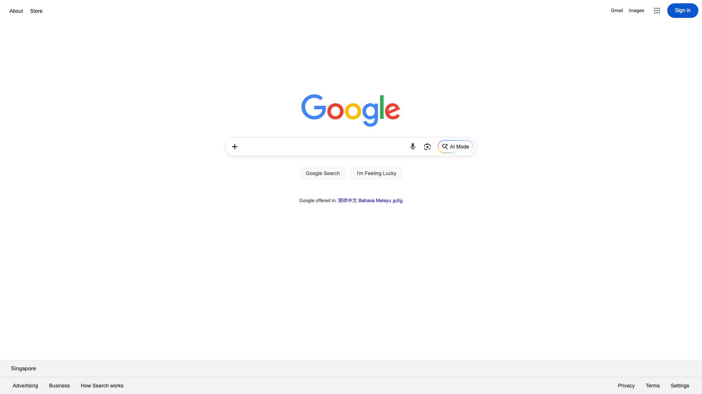
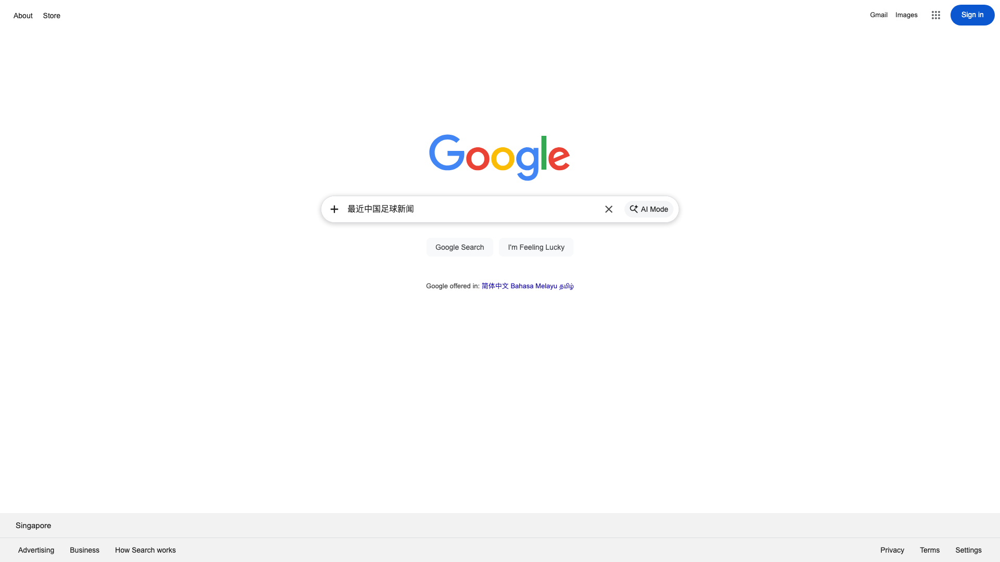
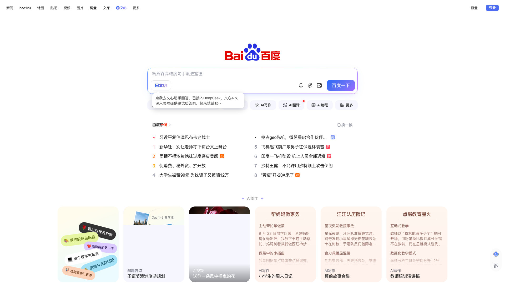
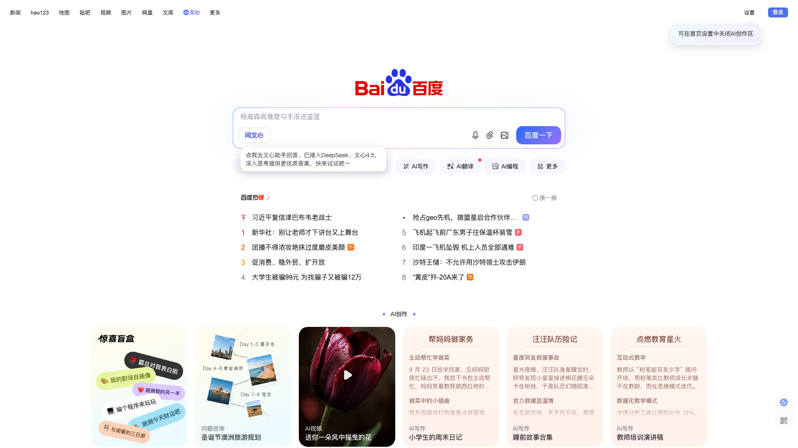
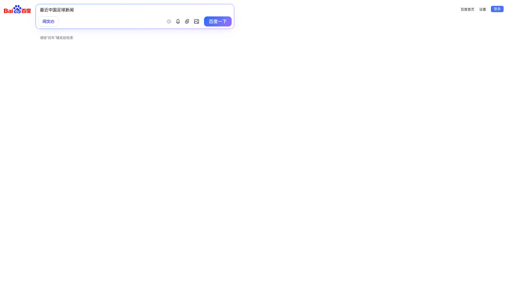
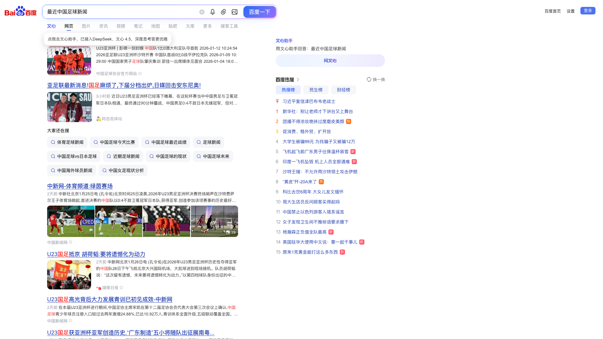
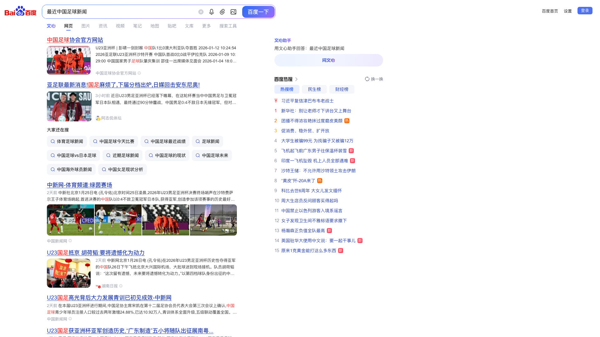

# 任务日志: 帮我Google一下 最近中国足球有什么新闻

## 概要

| 项目 | 值 |
| --- | --- |
| 任务 ID | `task-20260128-135134-odiu` |
| 状态 | ✅ 成功 |
| 开始时间 | 2026/1/28 13:51:34 |
| 总耗时 | 52.5s |
| 迭代次数 | 11 |
| 步骤数 | 10 |

## 执行步骤

### 步骤 1: browser_goto

**参数:**
```json
{
  "url": "https://www.google.com"
}
```

**耗时:** 2100ms

**截图:**



<details>
<summary><b>执行结果</b> (点击展开)</summary>

```
打开页面成功
URL: https://www.google.com/
Title: Google
```

</details>

---

### 步骤 2: browser_snapshot

**耗时:** 62ms

**截图:**


<details>
<summary><b>执行结果</b> (点击展开)</summary>

```
URL: https://www.google.com/
Title: Google

=== 页面文本 ===
About
Store
GmailImages
Sign in
AI Mode
 
Google offered in: 简体中文 Bahasa Melayu தமிழ்
Singapore
Advertising
Business
How Search works
Privacy
Terms
Settings

=== 可交互元素 ===
[ref_1] button "Upload files or images"
[ref_2] button[role=link]
[ref_3] a "About" -> https://about.google/?fg=1&utm_source=google-SG&ut
[ref_4] a "Store" -> https://store.google.com/SG?utm_source=hp_header&u
[ref_5] a "Gmail " -> https://mail.google.com/mail/&ogbl
[ref_6] a "Search for Images " -> https://www.google.com/imghp?hl=en&ogbl
[ref_7] a[role=button] "Google apps" -> https://www.google.com.sg/intl/en/about/products
[ref_8] a "Sign in" -> https://accounts.google.com/ServiceLogin?hl=en&pas
[ref_9] a "简体中文" -> https://www.google.com/setprefs?sig=0_nsh73YwooPn4
[ref_10] a "Bahasa Melayu" -> https://www.google.com/setprefs?sig=0_nsh73YwooPn4
[ref_11] a "தமிழ்" -> https://www.google.com/setprefs?sig=0_nsh73YwooPn4
[ref_12] a "Advertising" -> https://www.google.com/intl/en_sg/ads/?subid=ww-ww
[ref_13] a "Business" -> https://www.google.com/services/?subid=ww-ww-et-g-
[ref_14] a "How Search works" -> https://google.com/search/howsearchworks/?fg=1
[ref_15] a "Privacy" -> https://policies.google.com/privacy?hl=en-SG&fg=1
[ref_16] a "Terms" -> https://policies.google.com/terms?hl=en-SG&fg=1
[ref_17] input[type=submit][role=button] "Google Search"
[ref_18] input[type=submit] "I'm Feeling Lucky"
[ref_19] textarea[role=combobox]#APjFqb "Search"
[ref_20] div[role=button] "Search by voice"
[ref_21] div[role=button] "Search by image"
[ref_22] div[role=button] "Settings"
```

</details>

---

### 步骤 3: browser_type

**参数:**
```json
{
  "selector": "ref_19",
  "text": "最近中国足球新闻"
}
```

**耗时:** 39ms

**截图:**



<details>
<summary><b>执行结果</b> (点击展开)</summary>

```
输入成功
URL: https://www.google.com/
Title: Google
```

</details>

---

### 步骤 4: browser_press

**参数:**
```json
{
  "key": "Enter"
}
```

**耗时:** 161ms

**截图:**


<details>
<summary><b>执行结果</b> (点击展开)</summary>

```
Error: page.title: Execution context was destroyed, most likely because of a navigation
```

</details>

---

### 步骤 5: browser_snapshot

**耗时:** 36ms

**截图:**


<details>
<summary><b>执行结果</b> (点击展开)</summary>

```
URL: https://www.google.com/sorry/index?continue=https://www.google.com/search%3Fq%3D%25E6%259C%2580%25E8%25BF%2591%25E4%25B8%25AD%25E5%259B%25BD%25E8%25B6%25B3%25E7%2590%2583%25E6%2596%25B0%25E9%2597%25BB%26sca_esv%3D0bd1decbe45b1982%26source%3Dhp%26ei%3D6qN5aebFJYOXnesPutumoAk%26iflsig%3DAFdpzrgAAAAAaXmx-g585oic_JagXpZu6jOYo-aBXzfy%26ved%3D0ahUKEwjm4qqrxa2SAxWDS2cHHbqtCZQQ4dUDCBY%26uact%3D5%26oq%3D%25E6%259C%2580%25E8%25BF%2591%25E4%25B8%25AD%25E5%259B%25BD%25E8%25B6%25B3%25E7%2590%2583%25E6%2596%25B0%25E9%2597%25BB%26gs_lp%3DEgdnd3Mtd2l6IhjmnIDov5HkuK3lm73otrPnkIPmlrDpl7syCBAAGIAEGKIEMggQABiABBiiBDIFEAAY7wUyBRAAGO8FMgUQABjvBUiqF1AAWABwAHgAkAEAmAGyAaABsgGqAQMwLjG4AQPIAQD4AQGYAgGgArQBmAMAkgcDMC4xoAf3AbIHAzAuMbgHtAHCBwMwLjHIBwGACAA%26sclient%3Dgws-wiz%26sei%3D9qN5aazmD7rgseMPvJ_S-Ao&q=EgSigM-8GPbH5ssGIjA_5tZXB2l6F5KiqnTjDgwBY7h-spIoAUZlBDVr0E7Vsg93ZhqZOWF2EqmMGMQI0M8yAVJaAUM
Title: https://www.google.com/search?q=%E6%9C%80%E8%BF%91%E4%B8%AD%E5%9B%BD%E8%B6%B3%E7%90%83%E6%96%B0%E9%97%BB&sca_esv=0bd1decbe45b1982&source=hp&ei=6qN5aebFJYOXnesPutumoAk&iflsig=AFdpzrgAAAAAaXmx-g585oic_JagXpZu6jOYo-aBXzfy&ved=0ahUKEwjm4qqrxa2SAxWDS2cHHbqtCZQQ4dUDCBY&uact=5&oq=%E6%9C%80%E8%BF%91%E4%B8%AD%E5%9B%BD%E8%B6%B3%E7%90%83%E6%96%B0%E9%97%BB&gs_lp=Egdnd3Mtd2l6IhjmnIDov5HkuK3lm73otrPnkIPmlrDpl7syCBAAGIAEGKIEMggQABiABBiiBDIFEAAY7wUyBRAAGO8FMgUQABjvBUiqF1AAWABwAHgAkAEAmAGyAaABsgGqAQMwLjG4AQPIAQD4AQGYAgGgArQBmAMAkgcDMC4xoAf3AbIHAzAuMbgHtAHCBwMwLjHIBwGACAA&sclient=gws-wiz&sei=9qN5aazmD7rgseMPvJ_S-Ao

=== 页面文本 ===


About this page

Our systems have detected unusual traffic from your computer network. This page checks to see if it's really you sending the requests, and not a robot. Why did this happen?


IP address: 162.128.207.188
Time: 2026-01-28T05:51:51Z
URL: https://www.google.com/search?q=%E6%9C%80%E8%BF%91%E4%B8%AD%E5%9B%BD%E8%B6%B3%E7%90%83%E6%96%B0%E9%97%BB&sca_esv=0bd1decbe45b1982&source=hp&ei=6qN5aebFJYOXnesPutumoAk&iflsig=AFdpzrgAAAAAaXmx-g585oic_JagXpZu6jOYo-aBXzfy&ved=0ahUKEwj
... (truncated)
```

</details>

---

### 步骤 6: browser_goto

**参数:**
```json
{
  "url": "https://www.baidu.com"
}
```

**耗时:** 432ms

**截图:**



<details>
<summary><b>执行结果</b> (点击展开)</summary>

```
打开页面成功
URL: https://www.baidu.com/
Title: 百度一下，你就知道
```

</details>

---

### 步骤 7: browser_snapshot

**耗时:** 346ms

**截图:**



<details>
<summary><b>执行结果</b> (点击展开)</summary>

```
URL: https://www.baidu.com/
Title: 百度一下，你就知道

=== 页面文本 ===
新闻hao123地图贴吧视频图片网盘文库更多
设置
可在首页设置中关闭AI创作区
登录
点我去文心助手回答，已接入DeepSeek、文心4.5，深入思考提供更优质答案，快来试试吧～
百度一下
复杂问题就找文心助手 👉
立即体验
AI生图
AI写作
AI翻译
AI编程
更多

换一换
习近平复信津巴布韦老战士
抢占geo先机，微盟星启合作伙伴招募
商
1新华社：别让老师才下讲台又上舞台
5飞机起飞前广东男子往保温杯装雪
新
2团播不得浓妆艳抹过度磨皮美颜
热
6印度一飞机坠毁 机上人员全部遇难
新
3促消费、稳外贸、扩开放
7沙特王储：不允许用沙特领土攻击伊朗
4大学生被骗99元 为找骗子又被骗12万
8“黄皮”歼-20A来了
热
AI创作
推荐
办公搭子
学习导师
生活玩伴
创意素材
🌹 霸总对我表白啦
🎨 我的职场自画像
❤️ 测测我的另一半
💻 编个程序来玩玩
💰 测测今天财运吧
👭🏻 与闺蜜的三日游
🌛 睡不着听什么助眠🛏 如何建立稳定作息🏃🏻‍♀️ 减肥计划制定😄 给我讲个笑话🎵 旅游专用bgm🎨 动漫风格图片🤥 陪你聊聊天呀🎬 电影海报制作🎮 上班摸鱼小游戏❀ 办公桌适合的植物✍️ 旅行总结作文撰写🌻 最美的向日葵📖 玄幻小说推荐
问题咨询
圣诞节澳洲旅游规划
AI视频
送你一朵风中摇曳的花
帮妈妈做家务
主动帮忙学做菜
9 月 23 日放学回家，见妈妈厨房忙碌出汗，我放下书包主动帮忙，妈妈笑着教我做西红柿炒鸡蛋。
做菜中的小插曲
我系围裙学打鸡蛋差点掉蛋壳，妈妈教我挑出；切西红柿汁乱流，妈妈却夸我切得好。
AI写作
小学生的周末日记
汪汪队历险记
星夜突发救援事故
星光夜晚，汪汪队准备睡觉时，阿奇发现小星星掉进棉花糖云朵卡在树枝，于是队员们随即准备救援。
合力救援显温情
毛毛架云梯、天天托云朵，莱德指挥救援，安全送回小星星，狗狗基地变童话世界。
AI写作
睡前故事合集
点燃教育星火
互动式教学
教师以 “粉笔能写多少字” 提问开场，用粉笔类比教师成长关键不在教龄，而在思维模式迭代。
数据化教学模式
学情分析工具让班均分升 12%，还分享本校数学组借错题大数据精准辅导案例。
AI写作
教师培训演讲稿
AI视频
海上摩托艇探险之旅
AI阅读
英译中翻译专家
AI视频
森林之王的凝视
AI编程
圆形面积计算器
AI生图
制作同款雪景壁纸
AI生图
制作同款摄影图片
AI生图
制作同款雪景图片
AI视频
让灯塔与海浪交响
问题咨询
城市公积金基数对比
AI编程
抛硬币游戏编程
AI视频
花海漫步 照片变视频
AI阅读
高分作文思路解析
问题咨询
机票的查询与对比
AI生图
制作同款花卉油画
AI生图
制作同款卡通女孩插画
AI编程
网页定时器制作
AI生图
制作同款荷塘插画
AI阅读
摘要内容生成
AI阅读
面试模拟辅助
AI生图
制作同款街角壁纸
赛场奔跑的速度篇章
赛场速度之美
听发令枪如战鼓轰鸣，看起跑线似弯弓满月，运动员如箭矢闪电，每块颤抖肌肉书写速度诗篇。
奔跑过程的成长真谛
冲刺咬肌感乳酸灼热，弯道倾身抗离心力，冲线即胜昨日自己，奔跑本身是永恒勋章。
AI写作
运动会加油稿
AI视频
紫色机甲少女战士
88层时痕
[基础信息]
时间：2150年9月23日17:30 地点：新东京塔第88层量子电梯 人物： 唐琳（神经机械工程师） K7（电梯AI） 神秘老人（量子物理学家）
[场景]
透明舱壁外是流动的纳米云海，唐琳的AR眼镜突然弹出红色警报。电梯在88层暂停时，门缝渗入一缕不属于这个时代的檀香气味。
AI写作
科幻短剧脚本
问题咨询
车载磁吸手机壳选择
AI视频
老照片动起来
AI视频
描绘宝宝的海底梦境
AI PPT
大学班委竞选PPT
AI视频
与狮同行
AI阅读
文档内容概括
兼顾成长&瘦身的食谱
瘦身目标与原则
目标为保障生长发育时科学控重，原则是少油少糖、定时定量，搭配每日 30 分钟运动。
每日餐食与热量
早餐全麦面包等、午餐杂粮饭等、晚餐红薯等，加餐坚果或酸奶，每日热量 1800-2000 大卡。
AI写作
瘦身食谱计划制定
AI PPT
制作旅游攻略PPT
秋天的第一条秋裤
啊，秋裤
你比奶茶更懂我的温度
寒风在窗外搞偷袭
你给我藏了整个太阳
谁还需要温暖么
请在就近超市自行购买
AI写作
朋友圈文案
大学初见自我介绍
个人介绍与成长背景
大家好，我是19 岁新闻系新生林小雨，性格细腻爽朗，成长于书香家庭。
专业能力与未来期许
我曾经系统学新媒体运营，擅拍校园短视频获校奖，盼保好奇心、扎根专业探索未知。
AI写作
简单大方的自我介绍
AI
... (truncated)
```

</details>

---

### 步骤 8: browser_type

**参数:**
```json
{
  "selector": "ref_32",
  "text": "最近中国足球新闻"
}
```

**耗时:** 38ms

**截图:**



<details>
<summary><b>执行结果</b> (点击展开)</summary>

```
输入成功
URL: https://www.baidu.com/
Title: 百度一下，你就知道
```

</details>

---

### 步骤 9: browser_click

**参数:**
```json
{
  "selector": "ref_1"
}
```

**耗时:** 46ms

**截图:**



<details>
<summary><b>执行结果</b> (点击展开)</summary>

```
点击成功
URL: https://www.baidu.com/s?ie=utf-8&f=8&rsv_bp=1&rsv_idx=1&tn=baidu&wd=%E6%9C%80%E8%BF%91%E4%B8%AD%E5%9B%BD%E8%B6%B3%E7%90%83%E6%96%B0%E9%97%BB&fenlei=256&rsv_pq=0xe56fc40f000f542b&rsv_t=d88eGpGqXQS40TEcIOVH9Zd7OdSViCyxPUO2G5Jrr1sn%2ByW%2Faf8%2B7Y2T3%2BF2&rqlang=en&rsv_enter=1&rsv_dl=tb_pre
Title: 最近中国足球新闻_百度搜索
导航: 是
```

</details>

---

### 步骤 10: browser_snapshot

**耗时:** 79ms

**截图:**



<details>
<summary><b>执行结果</b> (点击展开)</summary>

```
URL: https://www.baidu.com/s?ie=utf-8&f=8&rsv_bp=1&rsv_idx=1&tn=baidu&wd=%E6%9C%80%E8%BF%91%E4%B8%AD%E5%9B%BD%E8%B6%B3%E7%90%83%E6%96%B0%E9%97%BB&fenlei=256&rsv_pq=0xe56fc40f000f542b&rsv_t=d88eGpGqXQS40TEcIOVH9Zd7OdSViCyxPUO2G5Jrr1sn%2ByW%2Faf8%2B7Y2T3%2BF2&rqlang=en&rsv_enter=1&rsv_dl=tb_pre
Title: 最近中国足球新闻_百度搜索

=== 页面文本 ===
百度首页设置登录
百度一下
网页
图片
资讯
视频
笔记
地图
贴吧
文库
更多
搜索工具
用文心助手回答：最近中国足球新闻

换一换
热搜榜民生榜财经榜

习近平复信津巴布韦老战士
1
新华社：别让老师才下讲台又上舞台
2
团播不得浓妆艳抹过度磨皮美颜热
3
促消费、稳外贸、扩开放
4
大学生被骗99元 为找骗子又被骗12万
5
飞机起飞前广东男子往保温杯装雪新
6
印度一飞机坠毁 机上人员全部遇难新
7
沙特王储：不允许用沙特领土攻击伊朗
8
“黄皮”歼-20A来了热
9
科比去世6周年 大女儿发文缅怀
10
周大生店员反问顾客买得起吗
11
中国禁止以色列游客入境系谣言
12
女子发现卫生间不雅标语要求撤下
13
杨瀚森正负值全队最高新
14
英国驻华大使用中文说：要一起干事儿新
15
原来1克黄金能打这么多东西新

中国足球协会官方网站

U23亚洲杯 | 彭啸一剑封喉 中国队1比0澳大利亚队夺首胜 2026-01-12 10:24:54 2026亚足联U23亚洲杯沙特开赛 中国队首战0比0战平伊拉克队 2026-01-09 10:29:00 中国国家男子足球队肇庆集训 邵佳一出席媒体见面会 2026-01-04 18:03:30 马晓旭出任中国U-17国家女子足球队主教练 ...
中国足球协会官方网站
亚足联最新消息!国足麻烦了,下届分档出炉,日媒回击安东尼奥!

3小时前近日U23男足亚洲杯已经落下帷幕，在这轮杯赛当中中国男足与卫冕冠军日本队相遇，最终通过90分钟鏖战，中国男足0:4不敌日本无缘冠军，但对于中国足球来说已经创造了历史，这群小伙子在回到国内也受到了球迷的欢呼，还有成批上千名球迷在机场接机。作为主帅安东尼奥也在结束了亚洲杯的赛事，直接从沙特飞往西班牙进行短暂的调整，预计会在

阿志侃体坛
大家还在搜
体育足球新闻
中国足球今天比赛
中国足球最近战绩
足球新闻
中国足球vs日本足球
近期足球新闻
中国足球的现状
中国足球未来
中国海外球员新闻
中国女足现状分析

中新网-体育频道:绿茵赛场

2天前中新社北京1月25日电 (孔令佑)北京时间25日凌晨,2026年U23男足亚洲杯决赛终场哨声在沙特费萨尔王子体育场响起,首进决赛的中国队以0:4不敌卫冕冠军日本队,获得亚军,创造参加该项赛事的历史最好成绩。从小组赛到决赛,这支年轻的队伍为处于低谷中的中国足球注入了久违的信心与希望。自2014年U2... 2026-01-25 10:59:08
19
中国新闻网

U23国足抵京 胡荷韬:要将遗憾化为动力

2天前中新网北京1月26日电 (孔令佑)在2026年U23男足亚洲杯历史性夺得亚军的中国队26日下午飞抵北京大兴国际机场，大批球迷到现场接机。队员胡荷韬说：“这次留有遗憾，未来要将遗憾转化为动力。”以第四档球队身份出征的中国队踢满六场比赛，最终决赛以0:4不敌日本U23男足，收获银牌，创下队史在该项赛事中的最佳战绩...
湖南日报

U23国足高光背后大力发展青训已初见成效-中新网

2天前在本届U23亚洲杯进行期间,中国足协主席宋凯在第十二届足协会员代表大会第三次会议上确认,中国足球青少年球员注册人口较过去两年激增24.88%,已达10.92万人,青训体系全面升级,五级联动覆盖全国。 随着近年来金元足球退潮,中国职业足球打破了以往对大牌外援和外教的依赖,不仅在投资方面趋于理性,投入方向也渐渐向培养年轻人才转...
中国新闻网

U23国足获亚洲杯亚军创造历史,“广东制造”五小将随队出征展南粤...

3天前赛后,国家体育总局、中国足协 向U23国家男子足球队致贺信 国家体育总局贺信 U23国家男子足球队: 在刚刚结束的2026年亚足联U23男足亚洲杯决赛中,你们勇夺亚军,创造了我国在该项赛事中的历史最佳成绩,也是中国男足国字号球队时隔22年再次晋级洲际赛事决赛,经验可贵,作风可赞,为中国足球振兴燃起新的希望。在此,谨向全体...
4
广东省体育局网站


... (truncated)
```

</details>

---

## 最终回答

太好了！我成功搜索到了最近中国足球的新闻。根据搜索结果，我可以为你总结一下最近中国足球的主要新闻：

## 最近中国足球新闻总结：

### 🏆 **重大突破：U23国足创造历史**
1. **2026年U23亚洲杯亚军**：中国U23男足在沙特举行的亚洲杯上历史性地打进决赛，最终以0:4不敌卫冕冠军日本队，获得亚军，创造了参加该项赛事的历史最好成绩。

2. **时隔22年再进洲际赛事决赛**：这是中国男足国字号球队时隔22年再次晋级洲际赛事决赛，意义重大。

3. **球队凯旋归国**：U23国足已于1月26日飞抵北京大兴国际机场，大批球迷到现场接机，队员胡荷韬表示要将遗憾转化为动力。

### 📈 **青训发展成效显著**
- **青少年球员注册人口激增**：中国足球青少年球员注册人口较过去两年激增24.88%，已达10.92万人
- **青训体系全面升级**：五级联动覆盖全国，大力发展青训已初见成效

### 🎖️ **官方表彰**
- **国家体育总局和中国足协联合发贺信**：向U23国家男子足球队致贺信，称赞其为中国足球振兴燃起新的希望

### 👥 **其他动态**
- **教练任命**：马晓旭出任中国U-17国家女子足球队主教练
- **国家队集训**：中国国家男子足球队在肇庆集训，邵佳一出席媒体见面会

这次U23亚洲杯的成功被认为是中国足球在低谷中的一次重要突破，为处于困境中的中国足球注入了久违的信心与希望。
