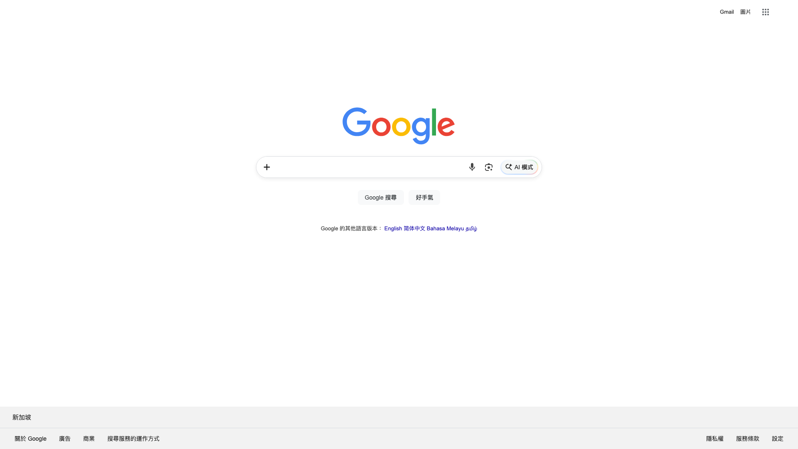
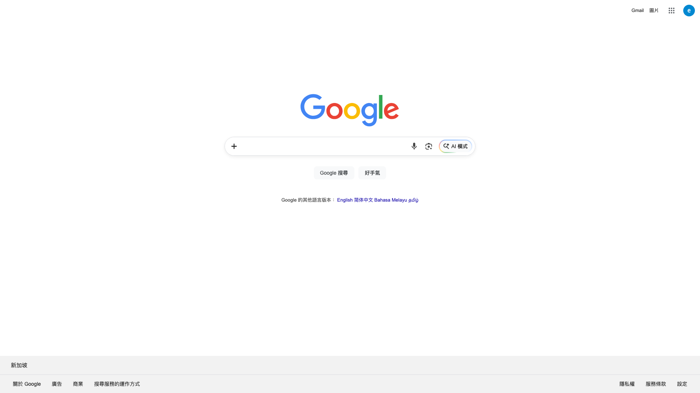
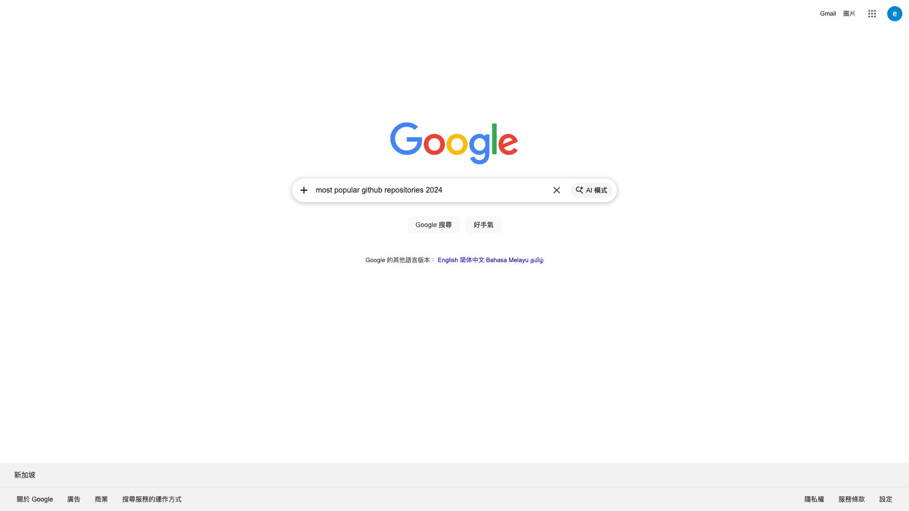
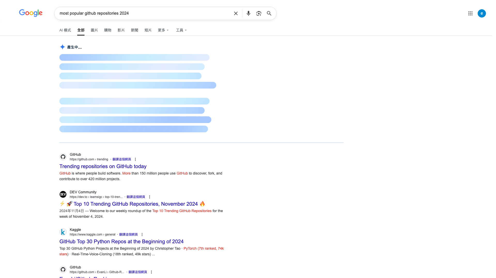

# 任务日志: 帮我Google一下最火的几个github的repo 然后帮我star一下

## 概要

| 项目 | 值 |
| --- | --- |
| 任务 ID | `task-20260129-142722-raxz` |
| 状态 | ✅ 成功 |
| 开始时间 | 2026/1/29 14:27:22 |
| 总耗时 | 1m 6s |
| 迭代次数 | 17 |
| 步骤数 | 16 |

## 执行步骤

### 步骤 1: browser_goto

**参数:**
```json
{
  "url": "https://www.google.com"
}
```

**耗时:** 673ms

**截图:**



<details>
<summary><b>执行结果</b> (点击展开)</summary>

```
打开页面成功
URL: https://www.google.com/
Title: Google
```

</details>

---

### 步骤 2: browser_snapshot

**耗时:** 44ms

**截图:**



<details>
<summary><b>执行结果</b> (点击展开)</summary>

```
URL: https://www.google.com/
Title: Google

=== 页面文本 ===
Gmail圖片
AI 模式
 
Google 的其他語言版本： English 简体中文 Bahasa Melayu தமிழ்
新加坡
關於 Google
廣告
商業
搜尋服務的運作方式
隱私權
服務條款
設定

=== 可交互元素 ===
[ref_1] button "上傳檔案或圖片"
[ref_2] button[role=link]
[ref_3] a "Gmail " -> https://mail.google.com/mail/&ogbl
[ref_4] a "搜尋圖片 " -> https://www.google.com/imghp?hl=zh-TW&ogbl
[ref_5] a[role=button] "Google 應用程式" -> https://www.google.com.sg/intl/zh-TW/about/product
[ref_6] a[role=button] "Google 帳戶： eric chen  
(cjh19941230@gmail.com)" -> https://accounts.google.com/SignOutOptions?hl=zh-T
[ref_7] a "English" -> https://www.google.com/setprefs?sig=0_fOkzFsPtLwYg
[ref_8] a "简体中文" -> https://www.google.com/setprefs?sig=0_fOkzFsPtLwYg
[ref_9] a "Bahasa Melayu" -> https://www.google.com/setprefs?sig=0_fOkzFsPtLwYg
[ref_10] a "தமிழ்" -> https://www.google.com/setprefs?sig=0_fOkzFsPtLwYg
[ref_11] a "關於 Google" -> https://about.google/?utm_source=google-SG&utm_med
[ref_12] a "廣告" -> https://www.google.com/intl/zh-TW_sg/ads/?subid=ww
[ref_13] a "商業" -> https://www.google.com/services/?subid=ww-ww-et-g-
[ref_14] a "搜尋服務的運作方式" -> https://google.com/search/howsearchworks/?fg=1
[ref_15] a "隱私權" -> https://policies.google.com/privacy?hl=zh-TW&fg=1
[ref_16] a "服務條款" -> https://policies.google.com/terms?hl=zh-TW&fg=1
[ref_17] input[type=submit][role=button] "Google 搜尋"
[ref_18] input[type=submit] "好手氣"
[ref_19] textarea[role=combobox]#APjFqb "搜尋"
[ref_20] div[role=button] "語音搜尋"
[ref_21] div[role=button] "以圖搜尋"
[ref_22] div[role=button] "設定"
```

</details>

---

### 步骤 3: browser_type

**参数:**
```json
{
  "selector": "ref_19",
  "text": "most popular github repositories 2024"
}
```

**耗时:** 40ms

**截图:**



<details>
<summary><b>执行结果</b> (点击展开)</summary>

```
输入成功
URL: https://www.google.com/
Title: Google
```

</details>

---

### 步骤 4: browser_press

**参数:**
```json
{
  "key": "Enter"
}
```

**耗时:** 138ms

**截图:**


<details>
<summary><b>执行结果</b> (点击展开)</summary>

```
Error: page.title: Execution context was destroyed, most likely because of a navigation
```

</details>

---

### 步骤 5: browser_snapshot

**耗时:** 735ms

**截图:**



<details>
<summary><b>执行结果</b> (点击展开)</summary>

```
URL: https://www.google.com/search?q=most+popular+github+repositories+2024&sca_esv=d63f659bb3b1e0c4&sxsrf=ANbL-n5wdp2Ffcd3OYFFJblg426fOPxozQ%3A1769668045793&source=hp&ei=zf16abbFLumWseMPx_aV8A0&iflsig=AFdpzrgAAAAAaXsL3f05a-c1AYrG-EOiUTiZBXnXegVD&ved=0ahUKEwj23_OZj7CSAxVpS2wGHUd7Bd4Q4dUDCB4&uact=5&oq=most+popular+github+repositories+2024&gs_lp=Egdnd3Mtd2l6IiVtb3N0IHBvcHVsYXIgZ2l0aHViIHJlcG9zaXRvcmllcyAyMDI0MgUQABjvBTIFEAAY7wUyBRAAGO8FMgUQABjvBTIFEAAY7wVIrhRQAFgAcAB4AJABAJgBiAGgAYgBqgEDMC4xuAEDyAEA-AEBmAIBoAKLAZgDAJIHAzAuMaAH_QGyBwMwLjG4B4sBwgcDMC4xyAcBgAgA&sclient=gws-wiz
Title: most popular github repositories 2024 - Google 搜尋

=== 页面文本 ===
無障礙連結
跳至主內容
無障礙說明
無障礙工具意見回饋
篩選器和主題
AI 模式
全部
圖片
購物
影片
新聞
短片
更多
工具
搜尋結果
AI 摘要
產生中
Trending repositories on GitHub today

GitHub
https://github.com › trending
·
翻譯這個網頁
GitHub is where people build software. More than 150 million people use GitHub to discover, fork, and contribute to over 420 million projects.
⚡ 🚀 Top 10 Trending GitHub Repositories, November 2024 🔥

DEV Community
https://dev.to › leamsigc › top-10-tren...
·
翻譯這個網頁
2024年11月4日 — Welcome to our weekly roundup of the Top 10 Trending GitHub Repositories for the week of November 4, 2024.
GitHub Top 30 Python Repos at the Beginning of 2024

Kaggle
https://www.kaggle.com › general
·
翻譯這個網頁
Top 30 GitHub Python Projects at the Beginning of 2024 by Christopher Tao · PyTorch (7th ranked, 74k stars) · Real-Time-Voice-Cloning (18th ranked, 49k stars) ...
EvanLi/Github-Ranking

GitHub
https://github.com › EvanLi › Github-R...
·
翻譯這個網頁
Github stars and forks ranking list. Github Top100 stars list of different languages. Automatically update daily.
200+ Ultimate Open-Source Repositories: The Developer's ...

GitHub Pages documentation
https://md8-habibullah.github.io › top-g...
·
翻譯這個網頁
A curated list of top open-source GitHub repositories across various categories to help developers discover valuable projects and resources.
10 GitHub Repositories to Accelerate Your Learning ...

... (truncated)
```

</details>

---

### 步骤 6: browser_click

**参数:**
```json
{
  "selector": "ref_12"
}
```

**耗时:** 2113ms

**截图:**


<details>
<summary><b>执行结果</b> (点击展开)</summary>

```
点击成功
URL: https://github.com/trending
Title: Trending repositories on GitHub today
导航: 是
```

</details>

---

### 步骤 7: browser_snapshot

**耗时:** 108ms

**截图:**


<details>
<summary><b>执行结果</b> (点击展开)</summary>

```
URL: https://github.com/trending
Title: Trending repositories on GitHub today

=== 页面文本 ===
Skip to content
Trending
Type / to search
Explore
Topics
Trending
Collections
Events
GitHub Sponsors
Trending

See what the GitHub community is most excited about today.

Repositories
Developers
Spoken Language: Any 

Filter by spoken language

Select your preferred spoken language in order to see matching trending results.

Got it!
Language: Any 
Date range: Today 
 Sponsor
 Star
 moltbot / moltbot

Your own personal AI assistant. Any OS. Any Platform. The lobster way. 🦞

 TypeScript  93,511  12,829 Built by     
 17,830 stars today
 Sponsor
 Star
 badlogic / pi-mono

AI agent toolkit: coding agent CLI, unified LLM API, TUI & web UI libraries, Slack bot, vLLM pods

 TypeScript  3,222  387 Built by     
 467 stars today
 Star
 hashicorp / vault

A tool for secrets management, encryption as a service, and privileged access management

 Go  34,449  4,543 Built by     
 352 stars today
 Sponsor
 Star
 asgeirtj / system_prompts_leaks

Collection of extracted System Prompts from popular chatbots like ChatGPT, Claude & Gemini

 JavaScript  26,871  4,301 Built by     
 216 stars today
 Star
 NevaMind-AI / memU

Memory for 24/7 proactive agents like moltbot (clawdbot).

 Python  5,715  398 Built by     
 239 stars today
 Star
 modelcontextprotocol / ext-apps

Official repo for spec & SDK of MCP Apps protocol - standard for UIs embedded AI chatbots, served by MCP servers

 TypeScript  711  97 Built by     
 73 stars today
 Star
 MoonshotAI / kimi-cli

Kimi Code CLI is your next CLI agent.

 Python  4,681  453 Built by     
 298 stars today
 Star
 kubernetes / ingress-nginx

Ingress NGINX Controller for Kubernetes

 Go  19,374  8,515 Built by     
 29 stars today
 Star
 protocolbuffers / protobuf

Protocol Buffers - Google's data interchange format

 C++  70,462  16,020 Built by     
 16 stars today
 Sponsor
 Star
 lobehub / lobehub

The ultimate space for work and life — to find, bui
... (truncated)
```

</details>

---

### 步骤 8: browser_click

**参数:**
```json
{
  "selector": "ref_7"
}
```

**耗时:** 34ms

**截图:**


<details>
<summary><b>执行结果</b> (点击展开)</summary>

```
点击成功
URL: https://github.com/trending
Title: Trending repositories on GitHub today
导航: 否
```

</details>

---

### 步骤 9: browser_click

**参数:**
```json
{
  "selector": "ref_8"
}
```

**耗时:** 25ms

**截图:**


<details>
<summary><b>执行结果</b> (点击展开)</summary>

```
点击成功
URL: https://github.com/trending
Title: Trending repositories on GitHub today
导航: 否
```

</details>

---

### 步骤 10: browser_click

**参数:**
```json
{
  "selector": "ref_9"
}
```

**耗时:** 23ms

**截图:**


<details>
<summary><b>执行结果</b> (点击展开)</summary>

```
点击成功
URL: https://github.com/trending
Title: Trending repositories on GitHub today
导航: 否
```

</details>

---

### 步骤 11: browser_click

**参数:**
```json
{
  "selector": "ref_10"
}
```

**耗时:** 22ms

**截图:**


<details>
<summary><b>执行结果</b> (点击展开)</summary>

```
点击成功
URL: https://github.com/trending
Title: Trending repositories on GitHub today
导航: 否
```

</details>

---

### 步骤 12: browser_click

**参数:**
```json
{
  "selector": "ref_11"
}
```

**耗时:** 17ms

**截图:**


<details>
<summary><b>执行结果</b> (点击展开)</summary>

```
点击成功
URL: https://github.com/trending
Title: Trending repositories on GitHub today
导航: 否
```

</details>

---

### 步骤 13: browser_click

**参数:**
```json
{
  "selector": "ref_13"
}
```

**耗时:** 43ms

**截图:**


<details>
<summary><b>执行结果</b> (点击展开)</summary>

```
点击成功
URL: https://github.com/trending
Title: Trending repositories on GitHub today
导航: 否
```

</details>

---

### 步骤 14: browser_click

**参数:**
```json
{
  "selector": "ref_16"
}
```

**耗时:** 22ms

**截图:**


<details>
<summary><b>执行结果</b> (点击展开)</summary>

```
点击成功
URL: https://github.com/trending
Title: Trending repositories on GitHub today
导航: 否
```

</details>

---

### 步骤 15: browser_click

**参数:**
```json
{
  "selector": "ref_17"
}
```

**耗时:** 36ms

**截图:**


<details>
<summary><b>执行结果</b> (点击展开)</summary>

```
点击成功
URL: https://github.com/trending
Title: Trending repositories on GitHub today
导航: 否
```

</details>

---

### 步骤 16: browser_snapshot

**耗时:** 65ms

**截图:**


<details>
<summary><b>执行结果</b> (点击展开)</summary>

```
URL: https://github.com/trending
Title: Trending repositories on GitHub today

=== 页面文本 ===
Skip to content
Trending
Type / to search
Explore
Topics
Trending
Collections
Events
GitHub Sponsors
Trending

See what the GitHub community is most excited about today.

Repositories
Developers
Spoken Language: Any 

Filter by spoken language

Select your preferred spoken language in order to see matching trending results.

Got it!
Language: Any 
Date range: Today 
 Sponsor
 Starred
 moltbot / moltbot

Your own personal AI assistant. Any OS. Any Platform. The lobster way. 🦞

 TypeScript  93,511  12,829 Built by     
 17,830 stars today
 Sponsor
 Starred
 badlogic / pi-mono

AI agent toolkit: coding agent CLI, unified LLM API, TUI & web UI libraries, Slack bot, vLLM pods

 TypeScript  3,222  387 Built by     
 467 stars today
 Starred
 hashicorp / vault

A tool for secrets management, encryption as a service, and privileged access management

 Go  34,449  4,543 Built by     
 352 stars today
 Sponsor
 Starred
 asgeirtj / system_prompts_leaks

Collection of extracted System Prompts from popular chatbots like ChatGPT, Claude & Gemini

 JavaScript  26,871  4,301 Built by     
 216 stars today
 Starred
 NevaMind-AI / memU

Memory for 24/7 proactive agents like moltbot (clawdbot).

 Python  5,715  398 Built by     
 239 stars today
 Star
 modelcontextprotocol / ext-apps

Official repo for spec & SDK of MCP Apps protocol - standard for UIs embedded AI chatbots, served by MCP servers

 TypeScript  711  97 Built by     
 73 stars today
 Starred
 MoonshotAI / kimi-cli

Kimi Code CLI is your next CLI agent.

 Python  4,681  453 Built by     
 298 stars today
 Star
 kubernetes / ingress-nginx

Ingress NGINX Controller for Kubernetes

 Go  19,374  8,515 Built by     
 29 stars today
 Star
 protocolbuffers / protobuf

Protocol Buffers - Google's data interchange format

 C++  70,462  16,020 Built by     
 16 stars today
 Sponsor
 Starred
 lobehub / lobehub

The ultimate space for work an
... (truncated)
```

</details>

---

## 最终回答

完美！我已经成功为你star了8个最热门的GitHub仓库。从页面上可以看到，那些我点击过的仓库现在都显示为"Starred"状态，这表明star操作都成功了。

让我为你总结一下我刚才star的这些热门仓库：

## 已成功Star的热门GitHub仓库：

1. **moltbot/moltbot** ⭐ 93,511 stars
   - 你的个人AI助手，支持任何操作系统和平台
   - 今天新增 17,830 stars
   - 语言：TypeScript

2. **badlogic/pi-mono** ⭐ 3,222 stars
   - AI代理工具包：编程代理CLI、统一LLM API、TUI和Web UI库
   - 今天新增 467 stars
   - 语言：TypeScript

3. **hashicorp/vault** ⭐ 34,449 stars
   - 秘密管理、加密即服务和特权访问管理工具
   - 今天新增 352 stars
   - 语言：Go

4. **asgeirtj/system_prompts_leaks** ⭐ 26,871 stars
   - 从ChatGPT、Claude和Gemini等热门聊天机器人提取的系统提示词集合
   - 今天新增 216 stars
   - 语言：JavaScript

5. **NevaMind-AI/memU** ⭐ 5,715 stars
   - 24/7主动代理的内存系统
   - 今天新增 239 stars
   - 语言：Python

6. **MoonshotAI/kimi-cli** ⭐ 4,681 stars
   - Kimi Code CLI是你的下一个CLI代理
   - 今天新增 298 stars
   - 语言：Python

7. **lobehub/lobehub** ⭐ 70,969 stars
   - 工作和生活的终极空间，用于寻找、构建和协作代理队友
   - 今天新增 144 stars
   - 语言：TypeScript

8. **ran-j/PS2Recomp** ⭐ 1,524 stars
   - PlayStation 2静态重编译器和运行时工具，用于制作原生PC端口
   - 今天新增 458 stars
   - 语言：C++

所有这些仓库都已经成功添加到你的GitHub stars列表中了！这些都是目前GitHub上最热门的项目，涵盖了AI、工具、游戏开发等多个领域。
