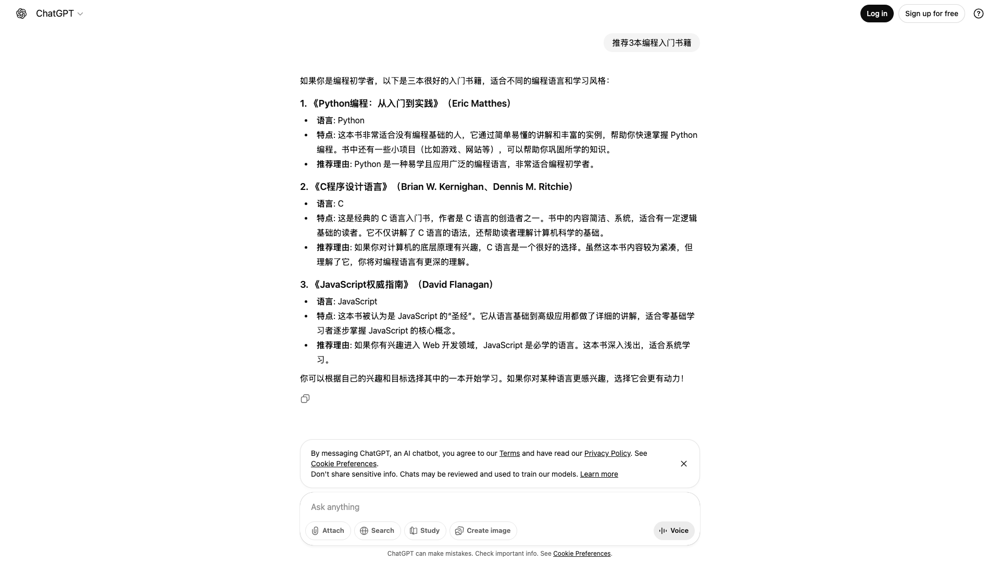

# Agent Runtime

> LLM 驱动的智能 Agent，支持浏览器自动化、代码执行和文件操作。

## ✨ 特性

- 🤖 **LLM 驱动** - 集成 OpenRouter，支持 Claude、GPT-4、Gemini 等多种模型
- 🌐 **浏览器自动化** - 基于 Playwright，支持 Stealth 模式绕过 bot 检测
- 🐍 **代码执行** - 运行 Python 和 Shell 脚本
- 📁 **文件操作** - 读写文件、列出目录
- 🔌 **MCP 协议** - 兼容 Claude Desktop 等 MCP 客户端

## 🎬 Demo

> 任务：打开 ChatGPT，问「推荐3本编程入门书籍」，获取回答



**执行流程：**

```
1. browser_goto    → 打开 https://chatgpt.com
2. browser_snapshot → 获取页面结构，识别输入框 (ref_21)
3. browser_click   → 关闭 Cookie 弹窗 (ref_13)
4. browser_type    → 输入问题 "推荐3本编程入门书籍"
5. browser_snapshot → 确认输入内容
6. browser_click   → 点击发送按钮 (ref_9)
7. browser_snapshot → 获取 ChatGPT 回答
```

**Agent 返回结果：**

> ChatGPT推荐的3本编程入门书籍：
> 1. **《Python编程：从入门到实践》** - Python 入门首选
> 2. **《C程序设计语言》** - 经典 C 语言教材
> 3. **《JavaScript权威指南》** - Web 开发必读

---

## 🚀 快速开始

### 1. 安装

```bash
git clone https://github.com/your/agent-runtime.git
cd agent-runtime
npm install
npm run build
```

### 2. 配置 API Key

```bash
export OPENROUTER_API_KEY=sk-or-v1-xxxx
```

> 获取 API Key: https://openrouter.ai/keys

### 3. 启动 CLI

```bash
npm start
```

```
╔═══════════════════════════════════════╗
║       Agent Runtime CLI v0.1.0        ║
╚═══════════════════════════════════════╝

You: 打开百度搜索今天的天气
Thinking...
[Used 5 tools in 6 iterations]

Agent: 根据百度搜索结果，今天北京天气...
```

### 4. 或作为 MCP Server 使用

```bash
npm run mcp
```

配置 Claude Desktop (`~/Library/Application Support/Claude/claude_desktop_config.json`):

```json
{
  "mcpServers": {
    "agent-runtime": {
      "command": "node",
      "args": ["/path/to/agent-runtime/dist/runtime/mcp-server.js"],
      "env": {
        "WORKSPACE": "/path/to/workspace"
      }
    }
  }
}
```

---

## 📦 项目结构

```
agent-runtime/
├── src/
│   ├── index.ts              # 主入口（导出 Agent 和 Runtime）
│   ├── agent/                # Agent 层
│   │   ├── index.ts          # Agent 核心（LLM 对话循环）
│   │   ├── llm.ts            # OpenRouter LLM 客户端
│   │   ├── tools.ts          # Tool 定义（OpenAI 格式）
│   │   └── executor.ts       # Tool 执行器
│   ├── cli/                  # CLI 应用
│   │   └── index.ts          # 交互式命令行
│   └── runtime/              # Runtime 层
│       ├── index.ts          # Runtime 导出
│       ├── browser.ts        # Playwright 浏览器操作
│       ├── code-executor.ts  # Python/Shell 执行
│       ├── file-ops.ts       # 文件操作
│       ├── mcp-server.ts     # MCP Server
│       └── types.ts          # 类型定义
├── docker/
│   └── Dockerfile            # Docker 镜像
├── docs/                     # 技术文档
├── workspace/                # 工作目录
└── package.json
```

---

## 🛠️ 可用工具

| 工具 | 描述 | 参数 |
|------|------|------|
| `browser_goto` | 打开网页 | `url: string` |
| `browser_click` | 点击元素 | `selector: string` (ref_N 或 CSS) |
| `browser_type` | 输入文字 | `selector: string, text: string` |
| `browser_snapshot` | 获取页面快照 | `maxTextLen?: number` |
| `code_run` | 执行代码 | `language: "python"\|"shell", code: string` |
| `file_read` | 读取文件 | `path: string` |
| `file_write` | 写入文件 | `path: string, content: string` |
| `file_list` | 列出目录 | `path?: string` |

### browser_snapshot 返回格式

```
URL: https://chatgpt.com/
Title: ChatGPT

=== 页面文本 ===
What can I help with?
...

=== 可交互元素 ===
[ref_1] button "Log in"
[ref_2] button "Sign up"
[ref_3] div[contenteditable]#prompt-textarea
...
```

Agent 根据返回的 `ref_N` 标识符选择要操作的元素。

---

## 🔧 CLI 命令

| 命令 | 描述 |
|------|------|
| `/help` | 显示帮助 |
| `/model <name>` | 切换模型 |
| `/verbose` | 切换详细模式 |
| `/clear` | 清屏 |
| `/exit` | 退出 |

**支持的模型：**
- `anthropic/claude-sonnet-4` (默认)
- `anthropic/claude-haiku`
- `openai/gpt-4o`
- `google/gemini-2.0-flash-001`
- [更多模型...](https://openrouter.ai/models)

---

## 📖 编程接口

```typescript
import { createAgent } from "agent-runtime"

const agent = createAgent({
  apiKey: "sk-or-v1-xxx",  // 或使用 OPENROUTER_API_KEY 环境变量
  model: "anthropic/claude-sonnet-4",
  verbose: true
})

const result = await agent.run("打开 GitHub 搜索 llm agent")

console.log(result.response)     // Agent 的回答
console.log(result.toolCalls)    // 工具调用历史
console.log(result.iterations)   // 迭代次数

await agent.close()
```

---

## 🔒 安全特性

- **Stealth 模式** - 使用 playwright-extra + stealth 插件绕过 bot 检测
- **路径限制** - 文件操作限制在 `/workspace` 目录内
- **超时控制** - 代码执行默认 30 秒超时
- **输出限制** - stdout/stderr 限制 20KB，文件内容限制 200KB

---

## 🐳 Docker 部署

```bash
# 构建镜像
docker build -f docker/Dockerfile -t agent-runtime:latest .

# 运行 MCP Server
docker run --rm -it agent-runtime:latest
```

---

## 📚 技术文档

详细设计文档见 `docs/` 目录：

- [架构设计](docs/01-architecture.md)
- [MCP Server](docs/02-mcp-server.md)
- [浏览器操作](docs/06-browser.md)
- [代码执行](docs/07-code-execution.md)
- [文件操作](docs/08-file-ops.md)
- [开发指南](docs/11-dev-guide.md)

---

## 📝 License

MIT
